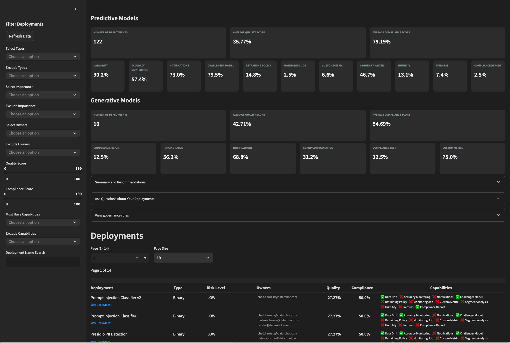

# MLOps smart audit

This accelerator outlines a workflow to create an application that provides an interactive dashboard for analyzing the MLOps configuration across multiple machine learning deployments. The application examines each deployment for enabled capabilities (e.g., data drift detection, accuracy monitoring, notifications, etc.) and produces a summarized, interactive view. This helps MLOps administrators assess deployment quality, identify gaps, prioritize improvements, and check compliance scores.

---

## Key features

- **Deployment overview:**  
  Quickly see which MLOps functions are enabled or disabled across your deployments.

- **Quality and compliance assessment:**  
  Each deployment is assigned:
  - A **Quality Score** based on the percentage of enabled capabilities.
  - A **Compliance Score** based on a set of mandatory functions and model risk levels.

- **Advanced filtering and search:**  
  Use sidebar filters to refine deployments by type, owner, capabilities, or score ranges.

- **LLM-Based insights (optional):**  
  When enabled, Azure OpenAI provides natural language summaries and recommendations.

- **Capability governance:**  
  View governance rules for capabilities categorized by importance (Critical, High, Moderate, Low) for both predictive and generative models.

---




---

## Requirements

The application distinguishes between two model types:

- **Predictive Models:** All deployments that are not classified as `TextGeneration`.
- **Generative Models:** Deployments with `model_type` equal to `TextGeneration`.

### External JSON file: `capability_requirements.json`

This file defines the required capabilities. A simplified version of the structure is:

```json
{
  "Predictive": {
    "Critical": [
      { "id": "data_drift", "displayName": "Data Drift" },
      { "id": "accuracy_monitoring", "displayName": "Accuracy Monitoring" }
      // ...
    ],
    "High": [
      { "id": "notifications", "displayName": "Notifications" }
      // ...
    ]
    // Other importance levels...
  },
  "Generative": {
    "Critical": [
      { "id": "accuracy_monitoring", "displayName": "Tracing Table" },
      { "id": "notifications", "displayName": "Notifications" }
      // ...
    ],
    "High": [
      { "id": "compliance_report", "displayName": "Compliance Report" }
      // ...
    ]
    // Other importance levels...
  }
}
```

**Required capabilities and risk levels:**
- The JSON file defines which capabilities are required for each model type and categorizes them by risk level (Critical, High, Moderate, Low).
- The dashboard uses these definitions to compute a compliance score for each deployment by checking how many of the mandatory capabilities (for its risk level) are enabled.

**Mapping display names:**
A helper function navigates the JSON structure to build a mapping from capability IDs to their display names. This mapping is then used throughout the UI to show friendly names for each capability.

**Usage:**
Place this file in your project’s root directory or adjust the path in your code.
The application uses this file to compute the compliance score and map capability IDs to user-friendly display names.

## Environment variables
Ensure the following environment variables are set:

- DATAROBOT_API_TOKEN
- DATAROBOT_ENDPOINT
- ENABLE_GENAI (set to "TRUE" to enable LLM insights)
- OPENAI_API_KEY (Optional)
- OPENAI_API_VERSION (Optional)
- AZURE_OPENAI_ENDPOINT (Optional)
- AZURE_OPENAI_DEPLOYMENT (Optional)
