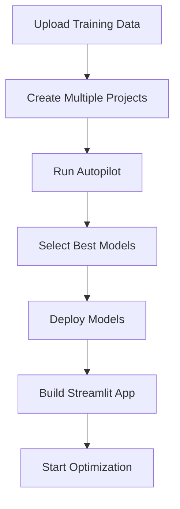
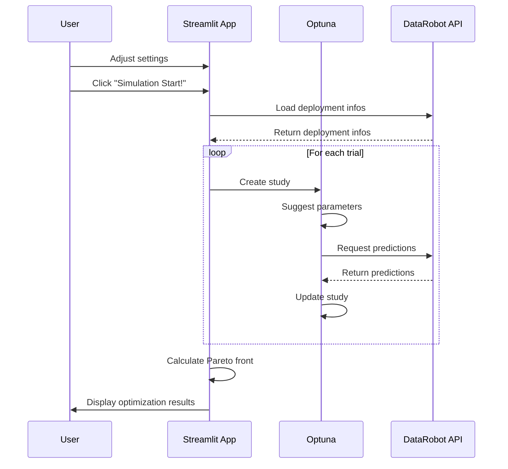

# Multi-objective Optimization streamlit app

**Author:** senkin.zhan@datarobot.com, yifu.gu@datarobot.com

## Problem framing

This AI Accelerator demonstrates how to implement a Streamlit application for multi-objective optimization using DataRobot deployments. Users can optimize multiple targets simultaneously.

## Accelerator overview

The following steps outline the accelerator workflow:

1. Create multiple DataRobot projects
   - Upload training data
   - Configure project settings for each target
   - Run Autopilot with cross-validation
   
2. Build deployments with best models
   - Select top performing model for each target
   - Create registered model version
   - Deploy models to prediction server

3. Setup Streamlit application
   - Upload app to DataRobot
   - Setup optimization parameters
   - Check optimization results

## Notebook process flow

## Optimization App process flow

## Optimization App Features

Current capabilities and features in planning:
- [x] Localization support (EN/JP)
- [x] Adjustable trial count
- [x] Numexpr support for individual optimization targets
- [ ] Numexpr support for constraints
- [ ] Adjustable optimization algorithms
- [x] Display hypervolume
- [x] Display target vs feature
- [x] Display 2D/3D paleto front
- [ ] Support resume optimization
- [ ] Batch trial optimization using study.tell()

## Resources

- [Multi-objective Optimization Guide](Multi-objective%20Optimization%20Guide.pdf)
- [Implementation Notebook](run_multi_objective_optimization.ipynb)
