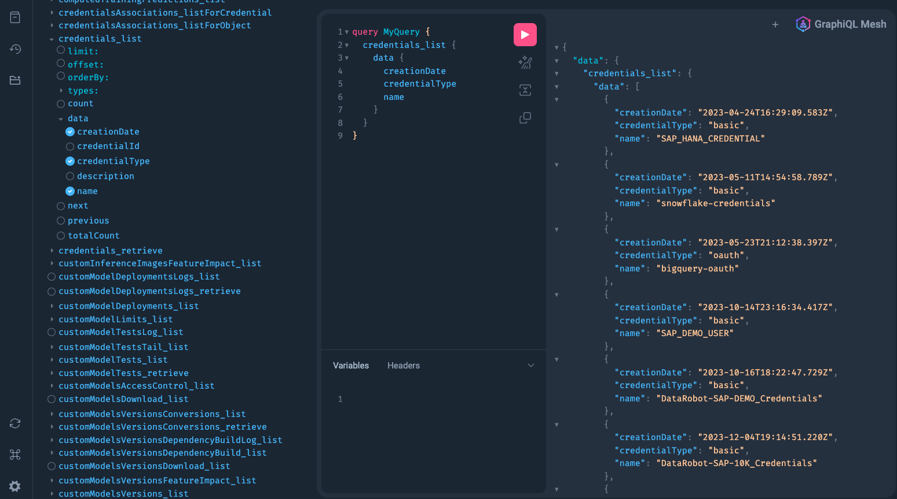

# DataRobot and GraphQL

This notebook is intended for a GraphQL developer who wants to integrate with DataRobot.

In this is example implementation, a GraphQL server is connecting to the DataRobot OpenAPI specification using  [GraphQL Mesh](https://the-guild.dev/graphql/mesh), the currently maintained option.

## Reference

Below are a some urls that where found useful during development

- https://the-guild.dev/graphql/mesh/docs/getting-started/installation
- https://app.datarobot.com/api/v2/openapi.yaml

## Requirements

For this process to work, the developer will need the folowing software available either via a command on the command line or as a url in the browser

- A working DataRobot log in with a valid API Key
- node
- yarn

### Prep the 3rd party software

```bash
npm i @graphql-mesh/cli graphql

yarn add concurrently # (optional: -W)
```

## Configure Mesh

Below is a sample of the `./DataRobot-GraphQL/packages/datarobot-source/.meshrc.yaml` which is used to configure the GraqhQL Mesh gateway

```yaml
sources:
  - name: DataRobot
    handler:
      openapi:
        source: https://app.datarobot.com/api/v2/openapi.yaml
        operationHeaders:
          Content-Type: application/json
          Authorization: Bearer <your key goes here>

transforms:
  - rename:
      renames:
        - from:
            type: Query
            field: AppController_(.*)
          to:
            type: Query
            field: $1
          useRegExpForFields: true
```

## Example GraphQL Mesh Server Start

```bash
yarn start-datarobot-source
yarn run v1.22.21
$ concurrently --kill-others "yarn workspace mesh-datarobot-source start"
$ mesh dev
[0] 💡 🕸️  Mesh - Server Starting GraphQL Mesh...
[0] 💡 🕸️  Mesh - DataRobot Generating GraphQL schema from OpenAPI schema
[0] 💡 🕸️  Mesh - DataRobot Processing annotations for the execution layer
[0] 💡 🕸️  Mesh Generating index file in TypeScript
[0] 💡 🕸️  Mesh - Server Serving GraphQL Mesh: http://0.0.0.0:4000
[0] 💡 🕸️  Mesh Writing index.ts for ESM to the disk.
[0] 💡 🕸️  Mesh Writing index.ts for CJS to the disk.
```

## Review the results

You can now start working with this integration by opening a browser and pointing to:

`http://localhost:4000/`

### Example Results

Below, please find example output for connecting to DataRobot via the OpenAPI spec via GraphQL UI @ http://0.0.0.0:4000

