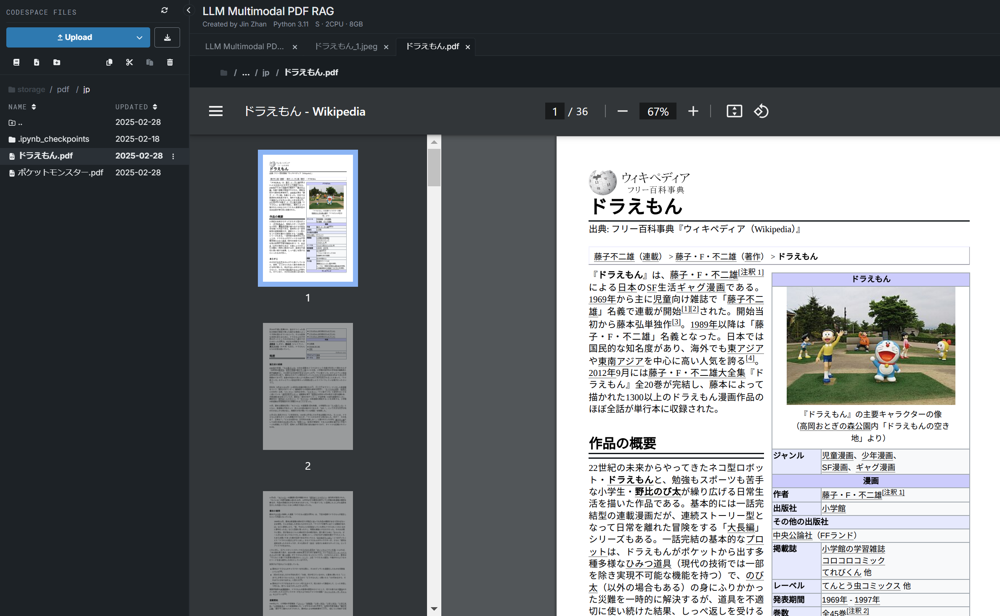
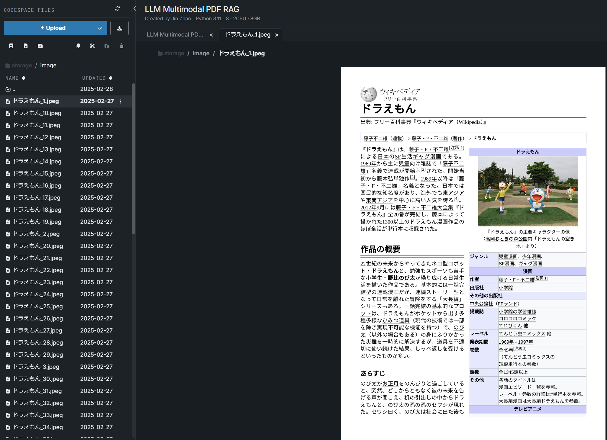
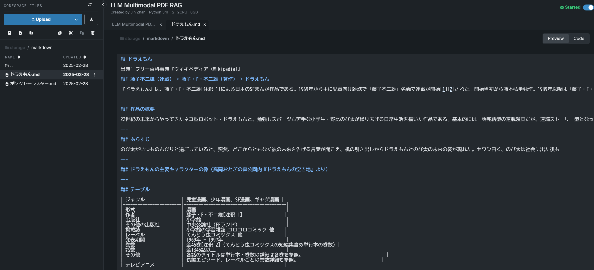
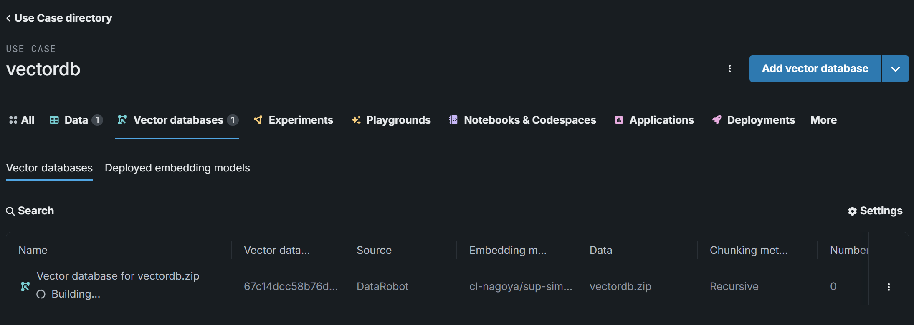
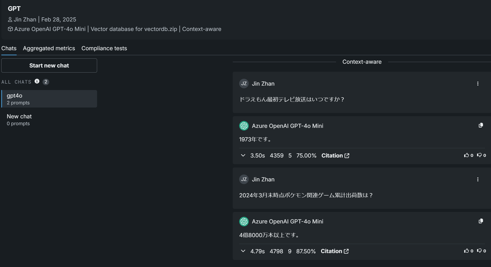

# Create a LLM Multimodal PDF RAG on DataRobot

**Author:** senkin.zhan@datarobot.com

[Download example data here](https://s3.us-east-1.amazonaws.com/datarobot_public_datasets/ai_accelerators/pdf_demo.zip)

## Problem framing

Open-source PDF OCR tools often make mistakes, so you can use an LLM instead. This AI accelerator introduces an approach to use an LLM as an OCR tool to extract all the text, table,  and graph data from PDF. Then you will build a RAG and a Playround chat on DataRobot.

## Accelerator overview

The following steps outline the accelerator workflow. 

1. Split the PDF into multiple images, one per page.

2. Extract all the text, table, and graph data from an image using an LLM, and save them as Markdown files.

|LLM provider          |  Recommended model      |
|----------------------|--------------------------|
| google               |  gemini-2.0-flash        |
| anthropic            |claude-3-7-sonnet-20250219|
| openai               | gpt-4o                   |
| azure                | gpt-4o                   |   

3. Build a vector database with the markdown files.

4. Build a Playground and chat.

