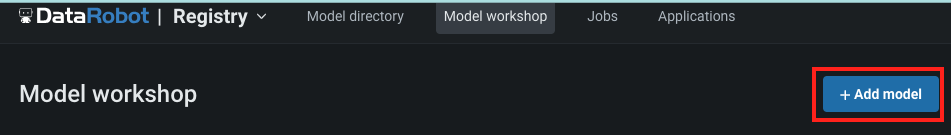
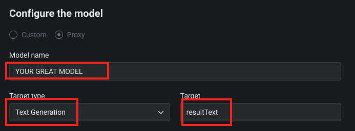
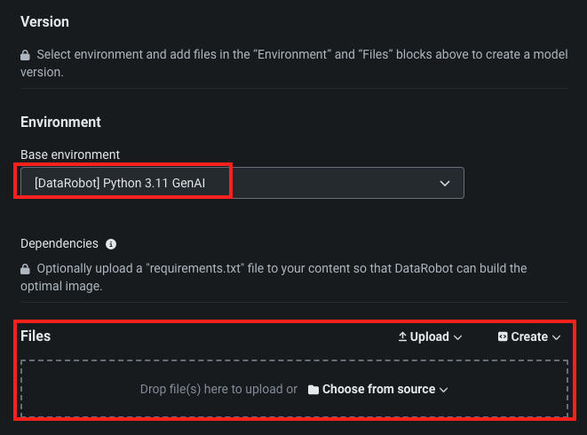

# LLM custom inference model template
There are a wide variety of LLM models, for example, OpenAI (not Azure), Gemini Pro, Cohere and Claude. Managing and monitoring these LLM models are crucial to use them. Data Drift monitoring by DataRobot MLOps enable us to detect the changes the user prompt and its responses and notify us that user might use different as AI builder expected initially. Sidecar models prevent the Jailbreak or replace Personally Identifiable Information or evaluate LLM response by our global model in the model registry or your created models. Data Export functionality reminds us of what the user desired to know at each moment or of necessary data you should be included in RAG system. Custom Metrics indicates your own KPI which you can make your decision e.g. token costs, toxicity and Hallucination.

In addition, Playground in DataRobot enables us to compare the RAG system of LLM models you would like to try once you deploy the models into DataRobot MLOps. You can obtain the best LLM model to accelerate your business. The comparison of variety of LLM models is key element to success the RAG system.

Here the DataRobot shows the collection of LLM custom inference model template, which enable you to deploy and accelerate to use your own LLM, along with the battery included LLMs like Azure OpenAI, Google and AWS. 
Currently, the DataRobot have the template for OpenAI (not Azure), Gemini Pro, Cohere and Claude. To use this template following the instruction. 

# How to use the template

1. Open the Model workshop in DataRobot Registry of NextGen. Push "+ Add Model" button to add the new custom model.

2. Select "Text Generation" in Target Type and write "resultText" in Target, and name your great model name in Model name.

3. Select Base environment (`[DataRobot] Python 3.11 GenAI` is selected to use the template. If you modify the environment, you can choose any appropriate environment) and then upload the model file from template.

> Note that the LLM custom inference model templates are in storage. 

4. Build model and then Enter runtime parameters.

5. Test and Deploy the model.

# Details of LLM custom inference model templates
The LLM custom inference model templates are in `/storage/templates` and there are `custom.py`, `model-metadata.yaml` and `requirements.txt`.

| filename            |  content               |
|---------------------|------------------------|
| custom.py           | call LLM model via API |
| model-metadata.yaml | model information and runtime parameter configuration |
| requirements.txt    | required library to call LLM API |

## List of template
- gemini-pro
- openai-gpt-3.5
- openai-gpt-4
- cohere 
- claude-3-opus
- claude-3-sonnet
- claude-3-haiku
- mistralai/Mixtral-8x7B-Instruct-v0.1(together.ai)
- meta-llama/Llama-2-13b-chat-hf(together.ai)
- NousResearch/Nous-Capybara-7B-V1p9(together.ai)
- deepseek-ai/deepseek-coder-33b-instruct(together.ai)
- google/gemma-7b-it(Cloudflare Workers AI)

## How to obtain api key
### gemini-pro
[Google AI for Developers](https://ai.google.dev/tutorials/setup).
Refer to the `Get an API key` section to create a key.

### OpenAI
- openai-gpt-3.5
- openai-gpt-4

[OpenAI website](https://openai.com/). You can find your OpenAI Secret API key on the [API key page](https://platform.openai.com/api-keys).

### cohere
- cohere command-r
- cohere command-r-plus

[Cohere AI website](https://docs.cohere.com/).

### claude
- claude-3-opus
- claude-3-sonnet
- claude-3-haiku

[ANTHROPIC website](https://www.anthropic.com/). You can find the docs [getting started with the api](https://docs.anthropic.com/claude/reference/getting-started-with-the-api).

### together.ai
- mistralai/Mixtral-8x7B-Instruct-v0.1
- meta-llama/Llama-2-13b-chat-hf
- NousResearch/Nous-Capybara-7B-V1p9
- deepseek-ai/deepseek-coder-33b-instruct

[together.ai website](https://www.together.ai/). You can find `sign in` page.
You can change the model as listed in the [Inference Models](https://docs.together.ai/docs/inference-models)

### Cloudflare Workers AI
- google/gemma-7b-it

[Workers AI website](https://dash.cloudflare.com/). You can find the docs and how to obtain credentials on its [developer site](https://developers.cloudflare.com/workers-ai/).  
You can change the model as listed in the [Models](https://developers.cloudflare.com/workers-ai/models/) page.

## Model Test
An example for custom LLM model is `storage/custom_model_prompts_example.csv`, we can upload and test the custom model.
