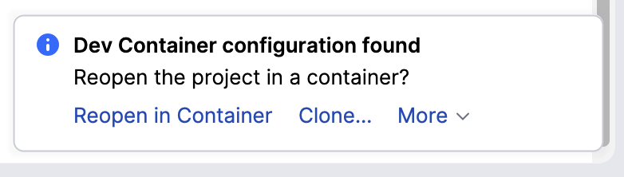
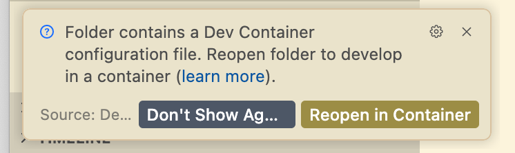
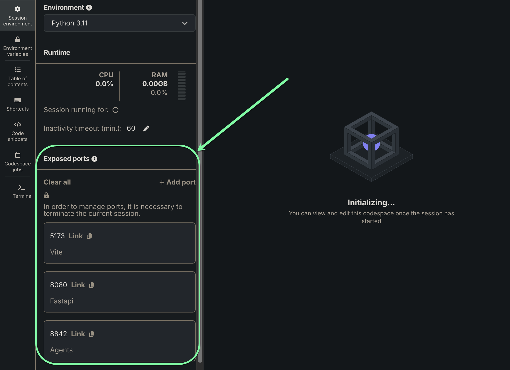

<p align="center">
  <a href="https://github.com/datarobot-community/datarobot-agent-application">
    
  </a>
</p>
<p align="center">
    <span style="font-size: 1.5em; font-weight: bold; display: block;">DataRobot Agentic Workflow Application Template</span>
</p>

<p align="center">
  <a href="https://datarobot.com">Homepage</a>
  ·
  <a href="https://docs.datarobot.com/en/docs/agentic-ai/agentic-develop/index.html">Documentation</a>
  ·
  <a href="https://docs.datarobot.com/en/docs/get-started/troubleshooting/general-help.html">Support</a>
</p>

<p align="center">
  <a href="https://github.com/datarobot-community/datarobot-agent-application/tags">
    
  </a>
  <a href="/LICENSE">
    
  </a>
</p>

This repository provides a ready-to-use application template for building and deploying agentic workflows with multi-agent frameworks, a FastAPI backend server, a React frontend, and an MCP server.
The template streamlines the process of setting up new agentic applications with minimal configuration requirements.
It supports local development and testing, as well as one-command deployments to production environments within DataRobot.

> [!CAUTION]
> This repository updates frequently.
> Make sure to update your local branch regularly to obtain the latest changes.

# Table of contents

- [Quick start](#quick-start)
  - [Install prerequisite tools](#install-prerequisite-tools)
  - [Prepare your local development environment](#prepare-your-local-development-environment)
  - [Run your agent](#run-your-agent)
- [Develop your agent](#develop-your-agent)
- [Deploy your agent](#deploy-your-agent)
- [MCP server](#mcp-server)
- [OAuth applications](#oauth-applications)
- [Troubleshooting](#troubleshooting)
- [Get help](#get-help)

# Quick start

Follow the instructions in the sections below to install the prerequisite tools and develop your agent application locally.

> [!CAUTION]
> This repository is only compatible with macOS and Linux operating systems.
> If you are using Windows, consider using a [DataRobot codespace](https://docs.datarobot.com/en/docs/workbench/wb-notebook/codespaces/index.html), [Windows Subsystem for Linux (WSL)](https://learn.microsoft.com/en-us/windows/wsl/install), or a virtual machine running a supported OS.

## Install prerequisite tools

Before you begin, you'll need the following tools installed.
If you already have these tools installed, ensure that they are at the required version (or newer) indicated in the table below.
For example commands to install the tools, see the [Detailed installation commands](#detailed-installation-commands) section.

| Tool         | Version    | Description                     | Installation guide            |
|--------------|------------|---------------------------------|-------------------------------|
| **dr-cli**   | >= 0.2.22  | The DataRobot CLI.              | [dr-cli installation guide](https://github.com/datarobot-oss/cli?tab=readme-ov-file#installation) |
| **git**      | >= 2.30.0  | A version control system.       | [git installation guide](https://git-scm.com/book/en/v2/Getting-Started-Installing-Git)      |
| **uv**       | >= 0.9.0  | A Python package manager.        | [uv installation guide](https://docs.astral.sh/uv/getting-started/installation/)       |
| **Pulumi**   | >= 3.163.0 | An Infrastructure as Code tool. | [Pulumi installation guide](https://www.pulumi.com/docs/iac/download-install/)                   |
| **Taskfile** | >= 3.43.3  | A task runner.                  | [Taskfile installation guide](https://taskfile.dev/docs/installation)                        |
| **NodeJS**   | >= 24      | JavaScript runtime for frontend development. | [NodeJS installation guide](https://nodejs.org/en/download/)                        |

> [!TIP]
> Make sure to install the tools **system-wide** rather than in a virtual environment so they are available in your terminal sessions.

### Detailed installation commands

The following sections provide example installation commands for macOS and Linux (Debian/Ubuntu/DataRobot codespace).
Click the drop down below that corresponds to your operating system:

- <details><summary><b>macOS</b></summary>
  <br>

  macOS users can install the prerequisite tools using Homebrew. First, install Homebrew if you don't already have it.

  ```sh
  /bin/bash -c "$(curl -fsSL https://raw.githubusercontent.com/Homebrew/install/HEAD/install.sh)" # If homebrew is not already installed
  ```

  Then, install the prerequisite tools with it:

  ```sh
  brew install datarobot-oss/taps/dr-cli uv pulumi/tap/pulumi go-task node git
  ```

</details>

- <details><summary><b>Linux</b></summary>
  <br>

  Linux users can install the prerequisite tools using the package manager for their distribution.

  ```sh
  curl https://cli.datarobot.com/install | sh
  sudo apt-get update
  sudo apt-get install -y python3 python3-pip python3-venv
  sudo apt-get install -y git
  curl -LsSf https://astral.sh/uv/install.sh | sh
  curl -fsSL https://get.pulumi.com | sh
  sh -c "$(curl --location https://taskfile.dev/install.sh)" -- -d
  sudo apt-get install -y nodejs npm
  ```

</details>

> [!IMPORTANT]
> You will also need a compatible C++ compiler and build tools installed on your system to compile some Python packages.

<details><summary><i>Click here for details on using a development container</i></summary>

### Use a development container (experimental)

[Dev containers](https://containers.dev/) allow you to use a container environment for local development. They are integrated with [modern IDEs](https://containers.dev/supporting) such as VSCode and PyCharm, and the [Dev Container CLI](https://containers.dev/supporting#devcontainer-cli) allows you to integrate them with terminal-centric development workflows.

> [!NOTE]
> This can also be used as a solution for Windows development. [Docker Desktop](https://docs.docker.com/desktop/) is the recommended backend for running devcontainers, but any Docker-compatible backend is supported.

This template offers a `devcontainer` with all prerequisites installed. To start working in it:

1. Open the template in PyCharm (version >= 2023.2, Pro) or VSCode, and the IDE will prompt you to reopen it in a container.

*PyCharm*:



*VSCode*:



2. Click **Reopen in Container** to proceed.
3. If you work directly in the terminal, run:

```sh
devcontainer up --workspace-folder . \&\& devcontainer exec --workspace-folder . /bin/sh
```

</details>

> [!NOTE]
> If you do not have a pulumi account, use `pulumi login --local` for local login or create a free account at [the Pulumi website](https://app.pulumi.com/signup).

## Prepare your local development environment

> [!NOTE]
> If you are using a DataRobot codespace, you must expose several ports for local testing. See the [DataRobot codespace port configuration](#datarobot-codespace-port-configuration) section for more details.

Run the following command to start the local development environment:

```sh
dr start
```

This command starts an interactive wizard to guide you through configuring your application. It will automatically clone the application repository and create a `.env` file in the root directory populated with environment variables you specify.
The wizard provides guidance and context for each step, but for more details, click the dropdown below.

<details><summary><b>Click here for a detailed walkthrough of the wizard steps</b></summary>
<br>

1. Specify whether you wish to use the "low-code" agent template:
   - Press `y` to use the YAML-based NeMo Agent Toolkit template.
   - Press `n` to choose from a list of available agent templates.
2. After a few moments, the wizard opens a web browser window to automatically configure your API endpoint and key. Click **Proceed** to continue.
   - If the browser doesn't open automatically, look for a URL in the terminal output and open it manually.
   - Click **Proceed** in the browser to continue.
   - If you encounter authentication issues, ensure you're logged into DataRobot in your browser.
3. Specify the port for the local web application and press `Enter`. The default is `8842`.
4. If desired, specify the default execution environment for your agent and press `Enter`. The default is `[DataRobot] Python 3.11 GenAI Agents`.
5. Provide a secret key to sign cookies for your session and press `Enter`. If you do not provide a value, a randomly-generated one will be used.
6. Enter the URI for a database to use for the application and press `Enter`. The default is `sqlite+aiosqlite:///.data/database.sqlite`.
7. Select your backend OAuth provider and press `Enter`.
8. Specify your authorization server by selecting it from the list and pressing `Space`. Press `Enter` to confirm.

  > NOTE: For additional information on authorization server configuration, see the [OAuth applications documentation](docs/oauth-applications.md).

9. Enter a passphrase (or leave blank if you don't want to use a passphrase) for your Pulumi stack and press `Enter`.
10. Specify the ID of a DataRobot Use Case (e.g., `69331fad5e07469e7c4f5c6f`), if one is available, and press `Enter`.

   - You can find your Use Case ID by navigating to the Use Case in the DataRobot UI and copying the ID from the URL.
   - If left blank, a new Use Case will be created automatically.

11. Specify your LLM integration and press `Enter`.

   > NOTE: For additional information on LLM configuration, see the [LLM configuration documentation](docs/llm-configuration.md).

12. Specify the port for the MCP server and press `Enter`. The default is `9000`.
13. Review the `.env` configuration summary displayed and press `Enter` to confirm.

   > NOTE: This step will take several minutes to complete.

14. Once the configuration finishes, choose a Pulumi stack to use for your application and press `Enter`. If you wish to create a new stack, press `Enter` and you will be prompted to enter a name for it. The name cannot match any existing stack name.

</details>

> [!NOTE]
> When run for the first time, the `dr start` command prepares your development environment to develop and deploy your agent.
> This includes both environment and agent component configuration.
> After this first initialization, future `dr start` operations will only set up your local environment.
> For subsequent updates to the configuration of your agent component, please run the `dr component update` command.

> [!TIP]
> For detailed information about LLM configuration options, see [LLM configuration documentation](docs/llm-configuration.md).

After `dr start` completes successfully, you should see:

- A `.env` file in your project root
- Your application directory created (typically named `datarobot-agent-application` or based on your application name)

If you encounter any errors during setup, see the [Troubleshooting](#troubleshooting) section for help.

Now that your application is configured, proceed to the next section.

## Run your agent

> [!CAUTION]
> Do not proceed to this section until you have run `dr start`, detailed in the previous section.

Navigate to the application directory created during `dr start`:

```sh
cd datarobot-agent-application # or the custom directory name you specified during the wizard, if different
```

Then, run the following command to start all components of the application:

```sh
task dev
```

This starts four processes, running in parallel:

- Application frontend
- Application backend
- Agent
- MCP server

Once all services are running:

1. Open your web browser and navigate to [http://localhost:5173](http://localhost:5173)
2. You should see the agent application interface
3. Try sending a test message to verify everything is working

From here, you can start customizing your agent by adding your own logic and functionality. See the [Develop your agent](#develop-your-agent) section for more details.

> [!NOTE]
> You can also start individual services in separate terminal windows; for example, `task agent:dev` will start just the agent.

# Develop your agent

Now that your agent has been built and tested, you are ready to customize it by adding your own logic and functionality.
See the following documentation for more details:

- [Customize your agent](https://docs.datarobot.com/en/docs/agentic-ai/agentic-develop/agentic-development.html)
- [Add tools to your agent](https://docs.datarobot.com/en/docs/agentic-ai/agentic-develop/agentic-tools-integrate.html)
- [Configure LLM providers](https://docs.datarobot.com/en/docs/agentic-ai/agentic-develop/agentic-llm-providers.html)
- [Use the agent CLI](https://docs.datarobot.com/en/docs/agentic-ai/agentic-develop/agentic-cli-guide.html)
- [Add Python requirements](https://docs.datarobot.com/en/docs/agentic-ai/agentic-develop/agentic-python-packages.html)
- [Manage prompts](https://docs.datarobot.com/en/docs/agentic-ai/agentic-develop/agentic-development.html#modify-agent-prompts)

# Deploy your agent

> [!CAUTION]
> Ensure that you have tested your agent locally before deploying.

Next, deploy your agent to DataRobot, which requires a Pulumi login.

Run the following command to deploy your agent:

```sh
dr task run deploy
```

> [!NOTE]
> The deployment process will take several minutes to complete.

Once deployment is complete, the script displays the deployment details, as shown in the example below. Note that the deployment details will vary based on your configuration.

```sh
Outputs:
    AGENT_DEPLOYMENT_ID                               : "69331fad5e07469e7c4f5c6f"
    Agent Custom Model Chat Endpoint [apptest] [agent]: "https://datarobot.com/api/v2/genai/agents/fromCustomModel/69331f816e1bf9f1890d5d1d/chat/"
    Agent Deployment Chat Endpoint [apptest] [agent]  : "https://datarobot.com/api/v2/deployments/69331fad5e07469e7c4f5c6f/chat/completions"
    Agent Execution Environment ID [apptest] [agent]  : "680fe4949604e9eba46b1775"
    Agent Playground URL [apptest] [agent]            : "https://datarobot.com/usecases/69331e4c3be0efe3b95a7be0/agentic-playgrounds/69331e4d1c036307186c9b16/comparison/chats"
    Agentic Application Starter [apptest]             : "https://datarobot.com/custom_applications/6933204a9e21e9b59b5a7bee/"
    DATABASE_URI                                      : "sqlite+aiosqlite:////tmp/agent_app/.data/agent_app.db"
    DATAROBOT_APPLICATION_ID                          : "6933204a9e21e9b59b5a7bee"
    DATAROBOT_OAUTH_PROVIDERS                         : (json) []

    LLM_DEFAULT_MODEL                                 : "azure/gpt-4o-2024-11-20"
    SESSION_SECRET_KEY                                : "secretkey123"
    USE_DATAROBOT_LLM_GATEWAY                         : "1"
    [apptest] [mcp_server] Custom Model Id            : "69331eebb49131d3d5430ac7"
    [apptest] [mcp_server] Deployment Id              : "69331f1f30548f83b668d9dc"
    [apptest] [mcp_server] MCP Server Base Endpoint   : "https://datarobot.com/api/v2/deployments/69331f1f30548f83b668d9dc/directAccess/"
    [apptest] [mcp_server] MCP Server MCP Endpoint    : "https://datarobot.com/api/v2/deployments/69331f1f30548f83b668d9dc/directAccess/mcp"
```

# MCP server

The Model Context Protocol (MCP) is an open standard that allows AI agents, such as large language models (LLMs), to discover and interact with external data sources, applications, and services in a secure and structured way.
For detailed information about the MCP server, see [MCP server documentation](docs/mcp-server.md).

# OAuth applications

For detailed information about configuring OAuth applications, see [OAuth applications documentation](docs/oauth-applications.md).

# Troubleshooting

This section covers common issues you may encounter and how to resolve them.

## Ports reference

The following ports are used by the application components during local development:

| Port  | Component                    | Description                                    | Configurable |
|-------|------------------------------|------------------------------------------------|--------------|
| 8080  | Web application              | Main web interface (proxied frontend)          | No           |
| 5173  | Vite dev server              | Frontend development server                    | No           |
| 8842  | Agent endpoint               | Local agent service endpoint                   | Yes (in wizard) |
| 9000  | MCP server                   | Model Context Protocol server                  | Yes (via `MCP_SERVER_PORT`) |

> [!NOTE]
> Ports 8080 and 5173 are fixed. The agent endpoint (8842) can be configured during the `dr start` wizard, and the MCP server port (9000) can be changed by setting the `MCP_SERVER_PORT` environment variable in your `.env` file.

### DataRobot codespace port configuration

If you are developing within a DataRobot codespace, the development ports need to be exposed.
This is configured in the **Exposed Ports** section of your **Session Environment** tab (pictured below).
The ports in the table above must be exposed for local testing.
If you cloned this application template using the `dr start` command and selected it from the gallery, this configuration is performed automatically; otherwise (e.g., if cloned manually) you must configure these ports manually.

There is a link next to the port to a URL where the service can be accessed when running locally in the codespace.



## Port conflicts

### Issue: "Address already in use" or port conflict errors

**Symptoms**: Services fail to start with port conflict errors.

**Solutions**:

1. **Identify the process using the port**:

   ```sh
   # For port 8080 (web application)
   lsof -i :8080

   # For port 9000 (MCP server)
   lsof -i :9000

   # For port 5173 (Vite dev server)
   lsof -i :5173
   ```

2. **Kill the process** (replace `PORT` with the actual port number):

   ```sh
   lsof -i :PORT | grep LISTEN | awk '{print $2}' | xargs kill -9
   ```

3. **Or change the port**:
   - For MCP server: Set `MCP_SERVER_PORT` in your `.env` file
   - For agent endpoint: Configure during `dr start` wizard (default is 8842)

## Service startup issues

### Issue: Services won't start or fail immediately

**Solutions**:

1. **Verify prerequisites are installed**:

   ```sh
   dr --version
   git --version
   uv --version
   pulumi version
   task --version
   node --version
   ```

2. **Check dependencies are installed**:

   ```sh
   dr task run install
   ```

3. **Verify environment variables**:
   - Ensure `.env` file exists in the project root
   - Check that required variables are set (see [Prepare your local development environment](#prepare-your-local-development-environment) section)

4. **Check logs**:
   - Review terminal output for specific error messages
   - Check for missing API tokens or invalid endpoints

## Wizard issues

### Issue: `dr start` wizard fails or is interrupted

**Solutions**:

1. **Restart the wizard**:

   ```sh
   dr start
   ```

2. **Check for existing configuration**:
   - If `.env` file exists, you may need to remove it and start fresh:

     ```sh
     # Backup first if needed
     cp .env .env.backup
     rm .env
     dr start
     ```

3. **Verify DataRobot credentials**:
   - Ensure you have a valid DataRobot API token
   - Check that your DataRobot endpoint URL is correct
   - Verify your account has necessary permissions

4. **Check network connectivity**:
   - Ensure you can access your DataRobot instance
   - Verify firewall settings allow connections

## MCP server connection issues

### Issue: Agent can't connect to MCP server

**Symptoms**: Agent errors mention MCP connection failures or tools not available.

**Solutions**:

1. **Verify MCP server is running**:

   ```sh
   # Check if MCP server process is running
   curl http://localhost:9000/
   ```

2. **Check MCP server logs**:
   - Review the terminal where `dr task run mcp_server:dev` is running
   - Look for connection or authentication errors

3. **Verify port configuration**:
   - Check that `MCP_SERVER_PORT` in `.env` matches the port the server is using
   - See [Ports reference](#ports-reference) for default ports

4. **Check environment variables**:
   - Ensure `DATAROBOT_API_TOKEN` is set correctly
   - Verify `DATAROBOT_ENDPOINT` is correct

## OAuth configuration issues

### Issue: OAuth authentication fails or redirects don't work

**Solutions**:

1. **Verify redirect URLs**:
   - Ensure all callback URLs are added to your OAuth application
   - Check that URLs match exactly (including trailing slashes)
   - See [OAuth applications documentation](docs/oauth-applications.md) for required URLs

2. **Check OAuth credentials**:
   - Verify `GOOGLE_CLIENT_ID` and `GOOGLE_CLIENT_SECRET` (or Box equivalents) are set in `.env`
   - Ensure credentials are correct and not expired

3. **Verify OAuth scopes**:
   - Check that all required scopes are enabled in your OAuth application
   - See provider-specific sections for required scopes

4. **Check OAuth providers in DataRobot**:
   - Navigate to `<your_datarobot_url>/account/oauth-providers`
   - Verify providers are created and configured correctly

## Deployment issues

### Issue: `dr task run deploy` fails

**Solutions**:

1. **Verify Pulumi is configured**:

   ```sh
   pulumi whoami
   ```

   - If not logged in, use `pulumi login --local` or create an account at [app.pulumi.com](https://app.pulumi.com/signup)

2. **Check prerequisites**:
   - Ensure all services tested locally before deploying
   - Verify `.env` file has all required variables

3. **Review Pulumi stack**:

   ```sh
   pulumi stack ls
   ```

   - Ensure you're using the correct stack
   - Check for stack configuration issues

4. **Check deployment logs**:
   - Review Pulumi output for specific error messages
   - Verify DataRobot API token has deployment permissions

## Frontend build issues

### Issue: Frontend build fails or displays errors

**Solutions**:

1. **Clear build cache**:

   ```sh
   cd frontend_web
   rm -rf node_modules dist
   npm install
   ```

2. **Check Node.js version**:

   ```sh
   node --version
   ```

   - Ensure Node.js >= 24 is installed (see [Prerequisite tools](#prerequisite-tools))

3. **Verify dependencies**:

   ```sh
   cd frontend_web
   npm install
   ```

## General debugging tips

1. **Check service status**:
   - Verify all required services are running in separate terminals
   - Check that services are listening on expected ports (see [Ports reference](#ports-reference))

2. **Review logs**:
   - Check terminal output for each running service
   - Look for error messages or stack traces

3. **Verify configuration**:
   - Review `.env` file for missing or incorrect values
   - Check that file paths and URLs are correct

4. **Test components individually**:
   - Try running services one at a time to isolate issues

5. **Update dependencies**:

   ```sh
   dr task run install
   ```

# Get help

If you encounter issues or have questions, try the following:

- Check the [DataRobot documentation](https://docs.datarobot.com/en/docs/agentic-ai/agentic-develop/index.html) for detailed guides.
- [Contact DataRobot](https://docs.datarobot.com/en/docs/get-started/troubleshooting/general-help.html) for support.
- Open an issue on the [GitHub repository](https://github.com/datarobot-community/datarobot-agent-application).
