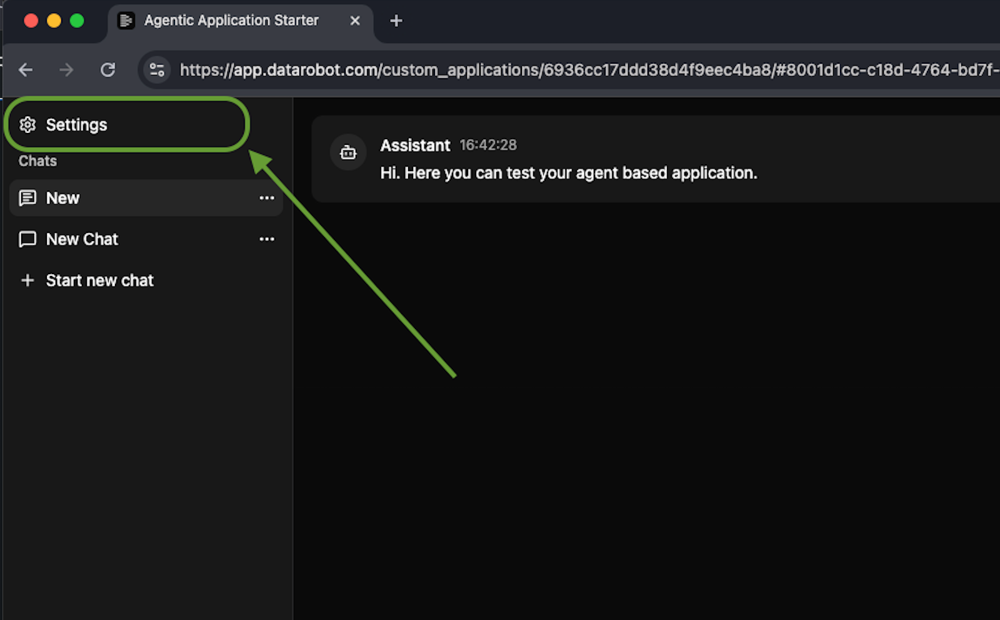
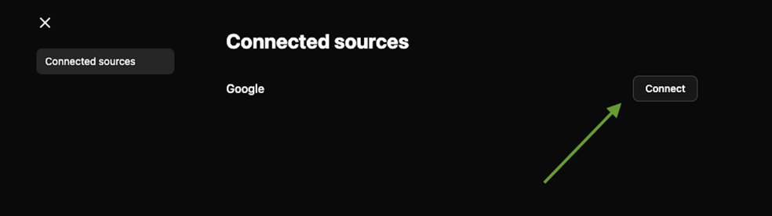

# OAuth applications

The template can work with files stored in Google Drive and Box.
To enable access to those files, you need to configure OAuth applications.
To view and manage your OAuth providers in the DataRobot UI, navigate to `<your_datarobot_url>/account/oauth-providers` or in [US production](https://app.datarobot.com/account/oauth-providers).

Follow the instructions corresponding to your OAuth application provider in the sections below.

## Google

To configure the Google OAuth application:

1. Go to [Google API Console](https://console.developers.google.com/) from your Google account.
2. Navigate to **APIs & Services > Enabled APIs & services > Enable APIs and services** and search for `Drive`, and add it.
3. Navigate to **APIs & Services > OAuth consent screen** and make sure you have your consent screen configured. You may have both `External` and `Internal` audience types.
4. Navigate to **APIs & Services > Credentials** and click on the **Create Credentials** button. Select **OAuth client ID**.
5. Select **Web application** as Application type, fill in **Name** & **Authorized redirect URIs** fields. For example, for local development, the redirect URL will be:
   - `http://localhost:5173/oauth/callback` - local vite dev server (used by frontend developers)
   - `http://localhost:8080/oauth/callback` - web-proxied frontend
   - `http://localhost:8080/api/v1/oauth/callback/` - the local web API (optional).
   - For production, you'll want to add your DataRobot callback URL. For example, in US Prod it is `https://app.datarobot.com/custom_applications/{appId}/oauth/callback`. For any installation of DataRobot it is `https://<datarobot-endpoint>/custom_applications/{appId}/oauth/callback`.
6. Click **Create** when you are done.
7. Copy the **Client ID** and **Client Secret** values from the created OAuth client ID and set them in the template `.env` file as `GOOGLE_CLIENT_ID` and `GOOGLE_CLIENT_SECRET` correspondingly.
8. Make sure you have the **Google Drive API** enabled in the **APIs & Services > Library** section. Otherwise, you will get 403 errors.
9. Finally, go to **APIs & Services > OAuth consent screen > Data Access** and make sure you have the following scopes selected:
   - `openid`
   - `https://www.googleapis.com/auth/userinfo.email`
   - `https://www.googleapis.com/auth/userinfo.profile`
   - `https://www.googleapis.com/auth/drive.readonly`.

## Box

To configure the Box OAuth application:

1. Navigate to the [Box Developer Console](https://app.box.com/developers/console) from your Box account
2. Create a new platform application, then select **Custom App** type
3. Fill in **Application Name** and select **Purpose** (e.g. **Integration**). Then, fill in three more info fields. The actual selection doesn't matter.
4. Select **User Authentication (OAuth 2.0)** as Authentication Method and click on the **Create App** button
5. In the **OAuth 2.0 Redirect URIs** section, please fill in callback URLs you want to use.
   - `http://localhost:5173/oauth/callback` - local vite dev server (used by frontend developers)
   - `http://localhost:8080/oauth/callback` - web-proxied frontend
   - `http://localhost:8080/api/v1/oauth/callback/` - the local web API (optional).
   - For production, you'll want to add your DataRobot callback URL. For example, in US Prod it is `https://app.datarobot.com/custom_applications/{appId}/oauth/callback`.
6. Click **Save Changes** after that.
7. Under the **Application Scopes**, please make sure you have both **Read all files and folders stored in Box** and **Write all files and folders stored in Box** checkboxes selected. Both are required as the template needs to "write" to the log that it has downloaded the selected files.
8. Finally, under the **OAuth 2.0 Credentials** section, you should be able to find your **Client ID** and **Client Secret** pair to set up in the template `.env` file as `BOX_CLIENT_ID` and `BOX_CLIENT_SECRET` respectively.

After you've set those in your project `.env` file, on the next `dr task run deploy`, OAuth providers will be created in your DataRobot installation.
The Pulumi output variables are used to populate those providers for your Codespace and local development environment as well.

## Application frontend

Once you have configured your OAuth provider (Google or Box), users can connect their accounts through the application frontend:

1. In the upper left corner of the application, click the **Settings** button to open the settings modal.

2. In the **Connected Sources** section, you'll see a row for each configured OAuth provider. Click the **Connect** button next to the provider you want to authorize to initiate the OAuth authorization flow.

