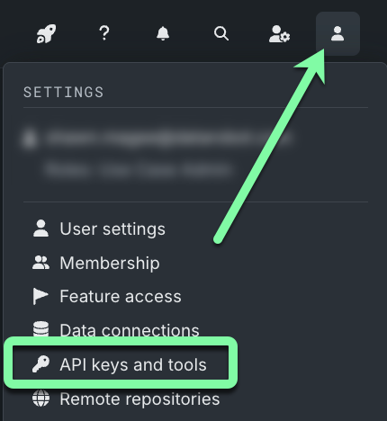
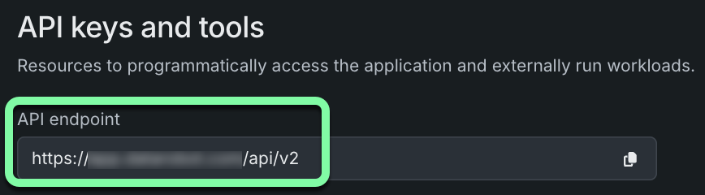
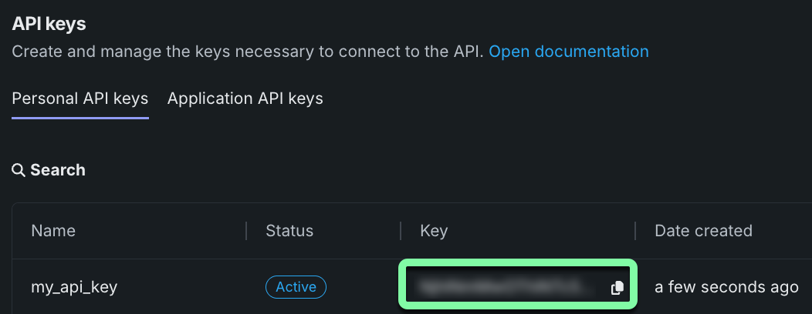
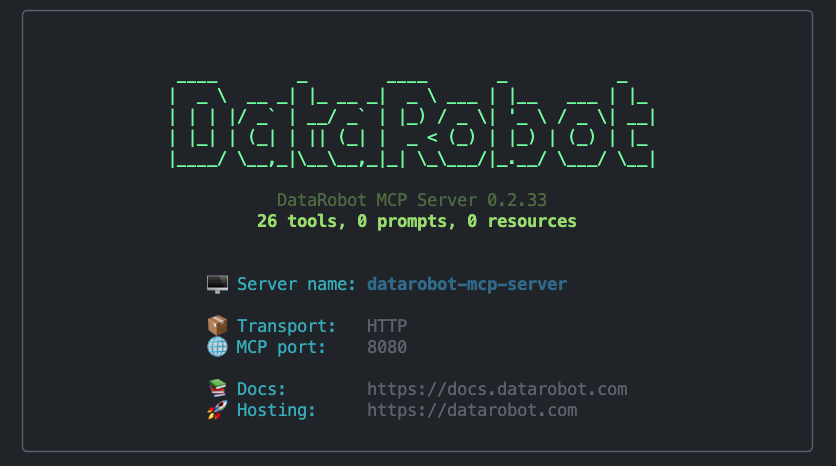
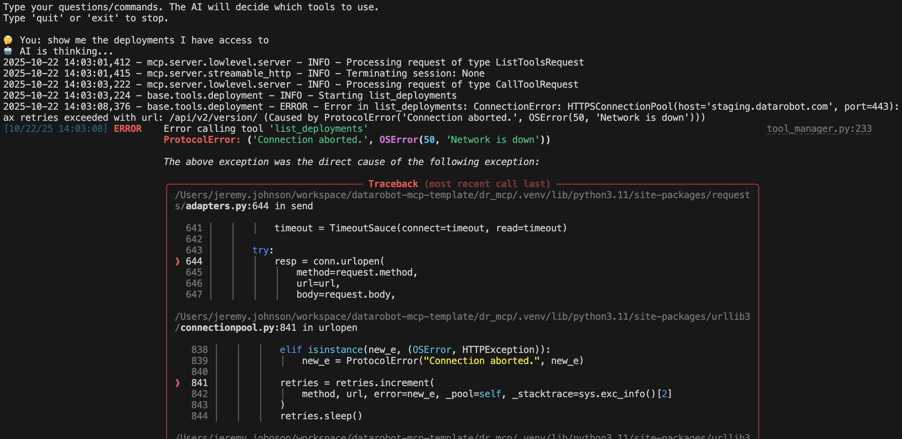
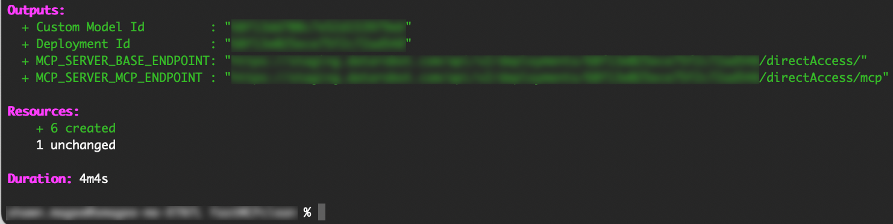
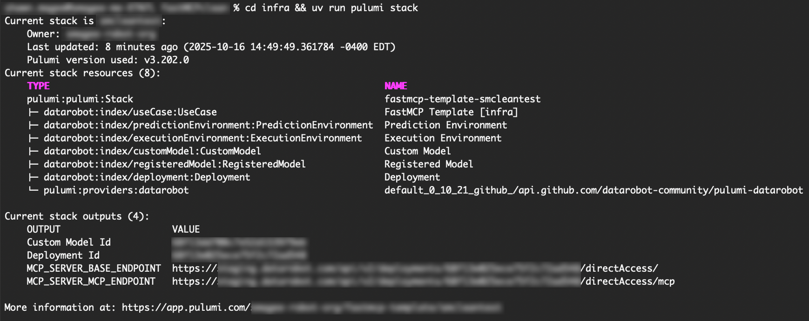

<p align="center">
  <a href="https://github.com/datarobot/recipe-fastmcp-template">
    
  </a>
</p>
<p align="center">
    <span style="font-size: 1.5em; font-weight: bold; display: block;">MCP Server Template for DataRobot</span>
</p>

<p align="center">
  <a href="https://datarobot.com">Homepage</a>
  ·
  <a href="https://docs.datarobot.com">Documentation</a>
  ·
  <a href="https://modelcontextprotocol.io/">MCP Protocol</a>
  ·
  <a href="https://docs.datarobot.com/en/docs/get-started/troubleshooting/general-help.html">Support</a>
</p>

<p align="center">
  <a href="./LICENSE.txt">
    
  </a>
  <a href="https://github.com/jlowin/fastmcp">
    
  </a>
  <a href="https://www.python.org/">
    
  </a>
</p>

This repository provides a production-ready template for building [FastMCP](https://github.com/jlowin/fastmcp) servers with DataRobot integration.
Once configured, the template results in a complete framework for creating MCP Servers to be used by agents for calling tools, prompts, and resources.
It can then be deployed as a DataRobot custom model application, enabling seamless integration with AI assistants like Cursor, Claude Desktop, and other MCP-compatible clients.

The template includes pre-built tools for common DataRobot operations, a structured approach for adding custom tools, automated deployment infrastructure, and production-ready features like OpenTelemetry tracing and dynamic tool registration.

---

# DataRobot MCP template navigation

- [Prerequisites](#prerequisites)
- [Get started](#getting-started)
- [Deployment](#deployment)
- [Next steps](#next-steps)
- [Advanced options](#advanced-options)
- [Get help](#get-help)
- [Contributing](#contributing)
- [Additional resources](#additional-resources)
- [License](#license)

# Prerequisites

The MCP server requires you to install the following tools:

- [Python](https://www.python.org/downloads/) (3.11+ required for infrastructure and backend development)
- [Taskfile.dev](https://taskfile.dev/#/installation) (task runner)
- [uv](https://docs.astral.sh/uv/getting-started/installation/) (Python package manager)
- [Pulumi](https://www.pulumi.com/docs/iac/download-install/) (infrastructure as code)
- [Homebrew](https://docs.brew.sh/Installation) (package manager, **macOS only**)

> **NOTE**: If you are using DataRobot codespaces, these prerequisites are already installed for you.

## DataRobot codespaces setup

When developing inside a DataRobot codespace, you must modify your codespace session environment to expose several ports.
Ports can be accessed from the **Session environment** tab, as shown below:


Enable the following ports:

- 8080 (MCP server)

After enabling the ports, you will see a link next to the port to a URL where the service can be accessed when running locally in the codespace.

## Example installation commands

For the latest installation instructions for your platform, refer to the links in the [Prerequisites](#prerequisites) section.
The following sections provide example installation commands for macOS, Linux (Debian/Ubuntu/DataRobot codespaces), and Windows (PowerShell).

### macOS

```sh
brew install python
brew install go-task/tap/go-task
brew install uv
brew install pulumi/tap/pulumi
```

### Linux (Debian/Ubuntu/DataRobot codespaces)

```sh
# Python
sudo apt-get update
sudo apt-get install -y python3 python3-pip python3-venv
# Taskfile.dev
sh -c "$(curl --location https://taskfile.dev/install.sh)" -- -d -b ~/.local/bin
# uv
curl -Ls https://astral.sh/uv/install.sh | sh
# Pulumi
curl -fsSL https://get.pulumi.com | sh
```

### Windows (PowerShell)

```powershell
# Python
winget install --id=Python.Python.3.12 -e
# Taskfile.dev
winget install --id=Task.Task -e
# uv
winget install --id=astral-sh.uv  -e
# Pulumi
winget install pulumi
winget upgrade pulumi
# Windows Developer Tools
winget install Microsoft.VisualStudio.2022.BuildTools --force --override "--wait --passive --add Microsoft.VisualStudio.Component.VC.Tools.x86.x64 --add Microsoft.VisualStudio.Component.Windows11SDK.22621"

# For Windows 10/11, toggle Developer Mode to "On" under System > For developer to enable symbolic link
# Additionally, we use symlinks in the repo. Set
git config --global core.symlink true
# Alternatively, you can do it for just this repo by omitting the --global and running this in the repo.
```

## Optional

- [**Docker**](https://docs.docker.com/engine/install/): For containerized deployment
- [**AWS Credentials**](https://docs.aws.amazon.com/cli/latest/userguide/cli-configure-files.html): If using AWS-related features (S3 predictions or memory.)
- [**Node.js**](https://nodejs.org/en/download/): Required for Claude Desktop MCP client setup

# Get started

## Clone the repository

```bash
git clone https://github.com/datarobot-community/datarobot-mcp-template.git
cd datarobot-mcp-template
```

## Install dependencies

> **NOTE**: This installs dependencies for both the MCP application and infrastructure components.

```bash
task install
```

## Configure environment variables

Create a `.env` file in the `mcp_server/` directory:

```bash
cd mcp_server
vim .env # or your preferred editor
```

Copy and paste the following into the `.env` file:

```bash
# Required
DATAROBOT_API_TOKEN=[YOUR_DATAROBOT_API_KEY]
DATAROBOT_ENDPOINT=[YOUR_DATAROBOT_ENDPOINT]

# Required: Random string for application security. Use a long password generated securely such as:
# `python -c "import os, binascii; print(binascii.hexlify(os.urandom(64)).decode('utf-8'))"`
SESSION_SECRET_KEY=[YOUR_SESSION_SECRET_KEY]

# Optional - Server configuration
# MCP_SERVER_NAME=datarobot-mcp-server
# MCP_SERVER_PORT=8080
# MCP_SERVER_LOG_LEVEL=WARNING
# APP_LOG_LEVEL=INFO

# Optional - Dynamic tool registration
# MCP_SERVER_REGISTER_DYNAMIC_TOOLS_ON_STARTUP=false

# Optional - MCP target_type configuration
# USE_MCP_TARGET_TYPE=true  # Set to false for older environments that don't support MCP

# Optional - AWS credentials (for batch predictions and memory)
# AWS_ACCESS_KEY_ID=your_aws_access_key
# AWS_SECRET_ACCESS_KEY=your_aws_secret_key
# AWS_PREDICTIONS_S3_BUCKET=your_s3_bucket

# Optional - Dynamic prompt registration
# MCP_SERVER_REGISTER_DYNAMIC_PROMPTS_ON_STARTUP=false
```

### Add API credentials

Open the DataRobot UI to locate and copy your DataRobot API key and endpoint to your environment variables in `.env`.

> **Note**: For full details, see the [DataRobot API keys documentation](https://docs.datarobot.com/en/docs/get-started/acct-mgmt/acct-settings/api-key-mgmt.html).

1. Log in to your DataRobot account.
2. Click the user icon in the top right of the UI and select **API keys and tools**.

  

3. Copy your DataRobot API endpoint and paste it into the `.env` file in place of `[YOUR_DATAROBOT_ENDPOINT]`.

  

4. Copy your DataRobot API key and paste it into the `.env` file in place of `[YOUR_DATAROBOT_API_KEY]`.

  

### Generate Session Secret Key (for DataRobot Codespaces)

1. Generate a session secret key with Python.
`python -c "import os, binascii; print(binascii.hexlify(os.urandom(64)).decode('utf-8'))"`

2. Copy the string and paste it into the `.env` file in place of `[YOUR_SESSION_SECRET_KEY]`.

## Run locally

From `/mcp_server/`, start the server locally using the `task dev` command:

```bash
task dev
```

The server will start on `http://localhost:8080` with the MCP endpoint at `http://localhost:8080/mcp/`.
Once the DataRobot logo appears, the server is running properly.



> **Note**: When finished, press `Ctrl+C` to stop the server.

From here, you can perform some optional interactive testing on the local server using the steps in the next section. If you would like to skip straight to deploying a server, proceed to [Deployment](#deployment).

### Test your tools interactively (optional)

Once the server is running, you can immediately test your tools with an AI agent using the interactive testing mode:

```bash
task mcp:test-interactive
```

This command will:
- Start the MCP server (if not already running locally)
- Start a local AI agent connected to your MCP server
- Provide an interactive chat interface to test your tools
- Show real-time debug output of MCP server operations
- Allow you to test tool implementations end-to-end prior to deployment

The interactive mode displays detailed logs showing:
- Tool registration and discovery
- Request processing and responses
- Error handling and debugging information
- Agent decision-making process


> **Note**: The interactive testing requires an internet connection for the LLM, but all tool execution happens locally through your MCP server.

### Error handling and debugging

When developing tools, you'll encounter errors that need quick resolution. The MCP server provides detailed error information to help you iterate rapidly. The `test-interactive` command displays all of these in one place for you to see as you are testing the tools:

- **Server logs** show real-time error details, including stack traces
- **Tool execution errors** are captured and displayed with context
- **Validation errors** highlight parameter issues immediately
- **Connection errors** provide clear diagnostic information



Common debugging steps:
1. Check server logs for detailed error messages
2. Verify tool parameters match expected types
3. Ensure DataRobot API credentials are valid
4. Test individual tool functions in isolation
5. Use the interactive mode to reproduce errors with real agent calls

# Deployment

Now that the local test passed, you can deploy the server to DataRobot.

**What gets deployed**

After deployment is successful, it creates the following resources:

- **Execution Environment**: Docker-based Python 3.12 environment (or uses an existing environment)
- **Custom Model**: MCP server packaged as an unstructured custom model
- **Registered Model**: Versioned model registration
- **Prediction Environment**: DataRobot Serverless platform
- **Deployment**: Active deployment with direct access endpoints

## Pulumi login

Pulumi requires a location to store the state of the application template. The easiest option is to
run:

```
pulumi login --local
```

DataRobot recommends using a shared backend like Pulumi Cloud, Ceph, Minio, S3, or Azure Blob Storage. See
[Managing Pulumi State and Backends](https://www.pulumi.com/docs/iac/concepts/state-and-backends/) for
more details. For production CI/CD information see our comprehensive
[CI/CD Guide for Application Templates](https://docs.datarobot.com/en/docs/workbench/wb-apps/app-templates/pulumi-tasks/cicd-tutorial.html).

## Deploy to DataRobot

1. Copy the `.env` file from the `mcp_server` directory to the root directory:

```bash
cd .. # Previous steps left off in the mcp_server directory
cp mcp_server/.env .env
```

2. Deploy to DataRobot using Pulumi:

> **Note**: During this process, you will be prompted to provide a new stack name and your Pulumi access token.
> If prompted to perform an update, select "yes". Deployment can take several minutes to complete.

```bash

# Optional: Use existing execution environment
# export DATAROBOT_DEFAULT_MCP_EXECUTION_ENVIRONMENT="[DataRobot] Python 3.11 GenAI Agents"

task deploy
```

When the deployment is complete, the process displays the MCP server details:



### Check deployment status

To check the overall deployment status:

```bash
task infra:info
```



### Destroy the deployment

When you are finished with the MCP server, you can destroy the deployment:

```bash
task destroy
```

## Connect to the deployed MCP server

Use the `MCP_SERVER_MCP_ENDPOINT` URL (shown in the **outputs** section in the screenshot above) to connect your MCP clients to the deployed server.

# Next steps

- [Configure your MCP client](/docs/mcp_client_setup.md) for instructions on connecting Cursor, VSCode, or Claude Desktop.
- [Develop custom tools](/docs/custom_tools.md) for instructions on adding custom tools to the server.
- See [MCP server architecture](/docs/mcp_server_architecture.md) for a detailed overview of the server architecture.
- [Advanced options](#advanced-options) for debugging, testing, and further customization.
- Read more about [dynamic tool registration](/docs/dynamic_tool_registration.md) for instructions on automatically registering tools with the server.

# Advanced options

## MCP target type configuration

The template supports both MCP and Unstructured target types for DataRobot custom models. By default, it uses the MCP target type, but you can configure it for older environments that don't support MCP.

### Environment variable configuration

Set the `USE_MCP_TARGET_TYPE` environment variable to control the target type:

```bash
# For older environments that don't support MCP
USE_MCP_TARGET_TYPE=false task deploy
```

## Runtime parameters

Customize deployment parameters by modifying the following files:

### infra/infra/mcp_server_user_params.py

Add your custom runtime parameters in the infrastructure:

```python
MCP_RECIPE_RUNTIME_PARAMETERS = [
    pulumi_datarobot.CustomModelRuntimeParameterValueArgs(
        key="recipe_name",
        type="string",
        value=os.getenv("RECIPE_NAME", "default-recipe"),
    ),
    # Add your custom runtime parameters here
]
```

### mcp_server/user-metadata.yaml

Add your custom runtime parameters to the schema:

```yaml
runtimeParameterDefinitions:
  - fieldName: user_name
    type: string
  # Add your custom runtime parameters here
```

### mcp_server/app/core/user_config.py

Update the parameter handling:

```python
class UserAppConfig(BaseSettings):
    """User-specific application configuration."""

    # Example of adding user-specific configuration
    user_name: str = Field(
        default="default-user",
        validation_alias=AliasChoices(
            RUNTIME_PARAM_ENV_VAR_NAME_PREFIX + "USER_NAME",
            "USER_NAME",
        ),
        description="Name of the user account in use.",
    )
```

These parameters will be available as environment variables in the deployed server and can be accessed through the `get_user_config()` function.

## Debugging

### Check logs

**Server logs** (local development):

- Logs print to console where you ran `task dev`
- Control verbosity with `MCP_SERVER_LOG_LEVEL` and `APP_LOG_LEVEL`

**MCP Client logs**:

- **Cursor**: View "MCP Logs" in the Output panel (View → Output → MCP Logs)
- **Claude Desktop**: Check `~/Library/Logs/Claude/mcp*.log`
- **VSCode**: Check the Output panel for MCP-related logs

### Common issues

<details>
<summary>Server won't start - "Address already in use"</summary>

Another process is using port 8080. Either kill that process or change the port:

```bash
cd mcp_server
export MCP_SERVER_PORT=8081
task dev
```

</details>

<details>
<summary>Client can't connect - "Connection refused"</summary>

1. Verify server is running: `curl http://localhost:8080/`
2. Check firewall settings
3. Verify the URL in your client config matches the server

</details>

<details>
<summary>Tools not showing up in client</summary>

1. Check server logs for tool registration errors
2. Verify your tools have proper docstrings and type hints
3. Restart the MCP client after server changes

</details>

# Get help

If you encounter issues or have questions:

- **Check Documentation**: Review the guides in `/docs/`
- **FastMCP Documentation**: [GitHub Repository](https://github.com/jlowin/fastmcp)
- **MCP Protocol**: [Model Context Protocol Specification](https://modelcontextprotocol.io/)
- **DataRobot Support**: [Contact Support](https://docs.datarobot.com/en/docs/get-started/troubleshooting/general-help.html)
- **Open an Issue**: [GitHub Issues](https://github.com/datarobot/recipe-fastmcp-template/issues)
- **Security Issues**: Email oss-community-management@datarobot.com

# Contributions

DataRobot welcomes contributions. Please see [CONTRIBUTING.md](./CONTRIBUTING.md) for detailed guidelines.

## Quick contribution guide

1. Fork the repository
2. Create a feature branch: `git checkout -b feature/my-feature`
3. Make your changes following our code standards
4. Run tests: `cd mcp_server && task test`
5. Run linters: `cd mcp_server && task lint`
6. Commit with proper license headers
7. Push and create a pull request

## Code standards

- All source and test files must include the Apache 2.0 license header
- Imports must be at the top of files (never inside functions)
- Follow RESTful principles for API endpoints
- Make minimal, focused changes - only modify files necessary for your feature
- Use type hints and comprehensive docstrings
- Write tests for new functionality

# Additional resources

- [FastMCP documentation](https://github.com/jlowin/fastmcp)
- [Model context protocol specification](https://modelcontextprotocol.io/)
- [DataRobot API documentation](https://docs.datarobot.com/)
- [DataRobot Python client](https://datarobot-public-api-client.readthedocs-hosted.com/)
- [Pulumi documentation](https://www.pulumi.com/docs/)
- [OpenTelemetry Python](https://opentelemetry.io/docs/instrumentation/python/)

# License

This project is licensed under the Apache License 2.0 - see [LICENSE](./LICENSE) for details.

Copyright 2025 DataRobot, Inc.

---

<p align="center">
  <strong>Built with ❤️ by DataRobot</strong>
</p>
