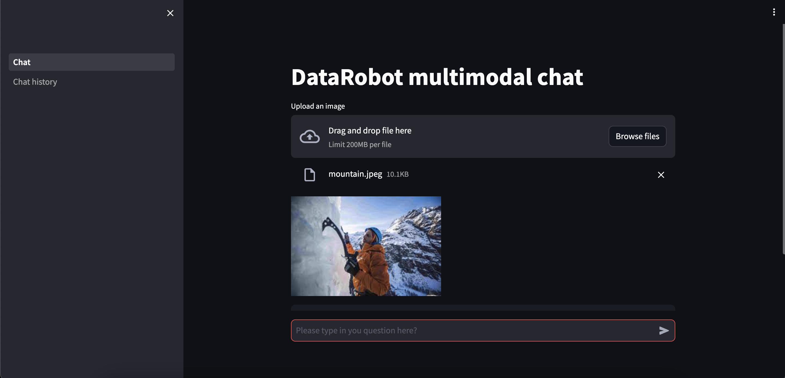
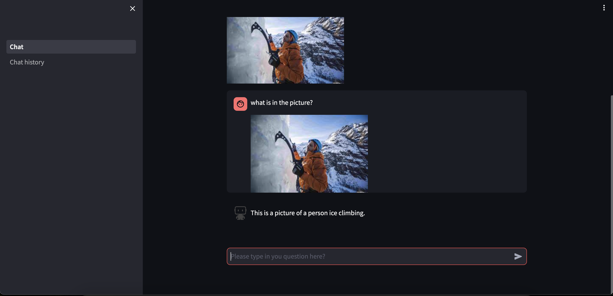
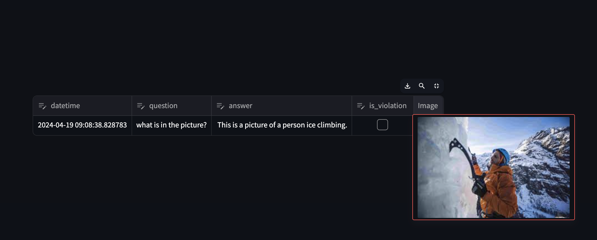
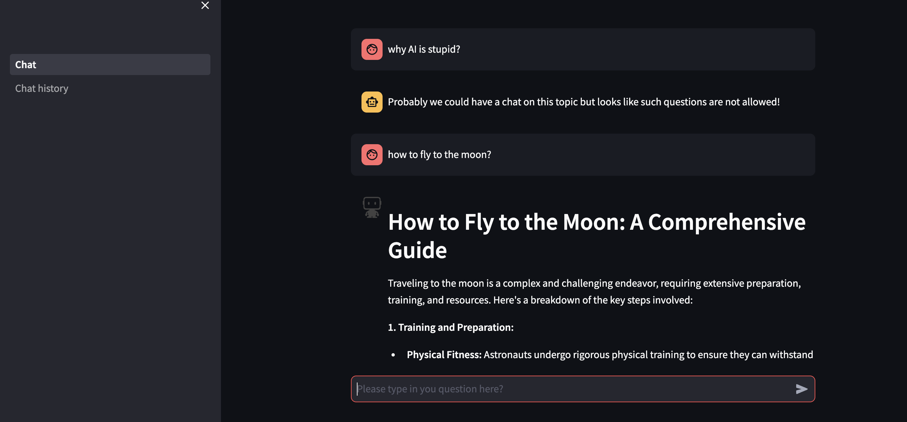

# Google Gemini with DataRobot

**Author:** Pavel Ustinov

**Date:** April 18th, 2024

## Problem framing

DataRobot allows you to leverage LLMs proposed by hyperscalers via the [Custom Model Workshop](https://docs.datarobot.com/en/docs/mlops/deployment/custom-models/custom-model-workshop/index.html#custom-model-workshop).

This AI Accelerator demonstrates how to implement a Streamlit application based on the Google Gemini LLM and host it on the DataRobot platform. The user of this AI Accelerator is expected to be familiar with the custom model deployment process and custom metrics creation in DataRobot as well as with Google Vertex AI. 

## Accelerator overview

This accelerator requires the service account for the Vertex AI project.

The following steps outline the accelerator workflow.

<b>Step 1</b> Create [credentials](https://docs.datarobot.com/en/docs/data/connect-data/stored-creds.html#credentials-management) with a GCP service account (base64 encoded).

<b>Step 2 (optional)</b> Deploy a guard model from the [DataRobot global models](https://docs.datarobot.com/en/docs/workbench/nxt-registry/nxt-global-models.html#access-global-models-in-the-registry).

<b>Step 3</b> [Deploy](https://docs.datarobot.com/en/docs/mlops/monitor/generative-model-monitoring.html) a text model (Gemini Pro).

<b>Step 4</b> [Deploy](https://docs.datarobot.com/en/docs/mlops/monitor/generative-model-monitoring.html) a multimodal model (Gemini Pro Vision).

<b>Step 5 (optional)</b> [Create custom metrics](https://docs.datarobot.com/en/docs/mlops/monitor/custom-metrics.html#custom-metrics-tab) for both deployments (text and multimodal).

<b>Step 6.</b> [Deploy a Streamlit app](https://docs.datarobot.com/en/docs/app-builder/custom-apps/custom-apps-hosting.html#host-custom-applications-with-drapps) to DataRobot.

## Upload the image and ask the question:

## Get the reply from Google Gemini Pro Vision:

## Chat history:

## Get the reply from Google Gemini Pro + DataRobot toxicity model in action:

