# Vectorstore Chunk Visualization App With DataRobot

**Author:** senkin.zhan@datarobot.com

**Demo Data:** https://s3.us-east-1.amazonaws.com/datarobot_public_datasets/ai_accelerators/DORAEMON.zip

## Problem framing

This AI Accelerator demonstrates how to implement a Streamlit application to gain insight from vectordatabase of chunks, RAG developer can compare similarity between chunks and remove unnecessary data during RAG development.

## Accelerator overview

The following steps outline the accelerator workflow.If you have errors refresh browser and click button again always can solve network or azure api issues.

## From nextgen->registry->application, build a streamlit application.
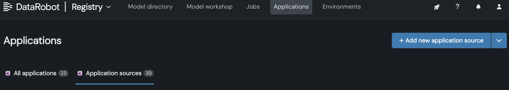
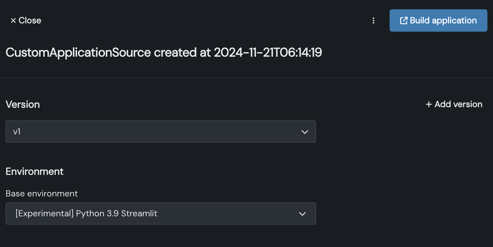
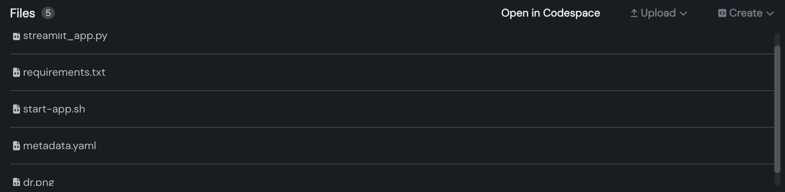
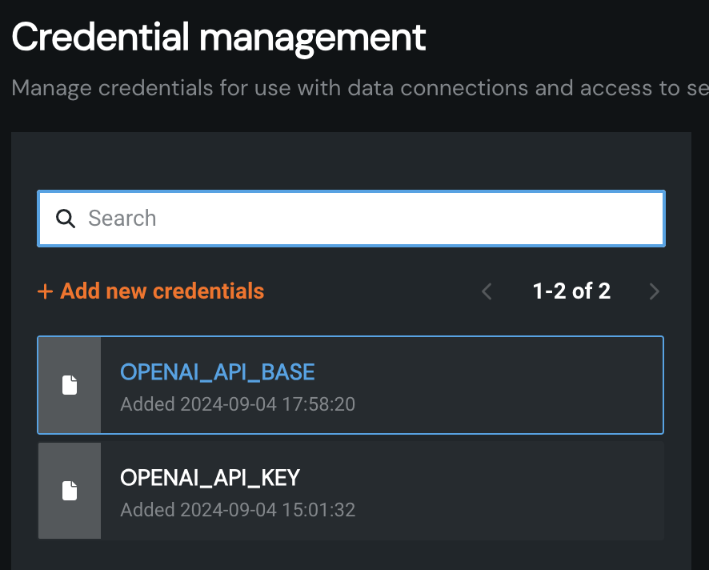 
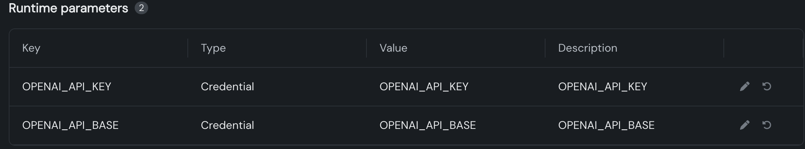

## If has exsited vectorstore, input vectorstore id.
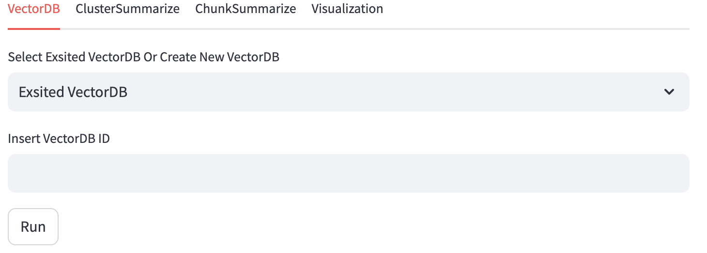

## If need to create a new vectorstore, upload document to build vectorstore on datarobot.
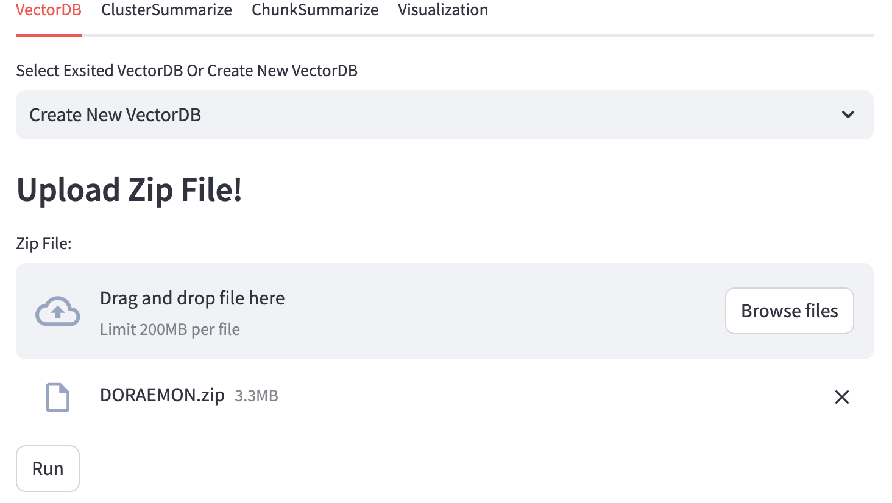

## Build summary of cluster by Azure OpenAI service.
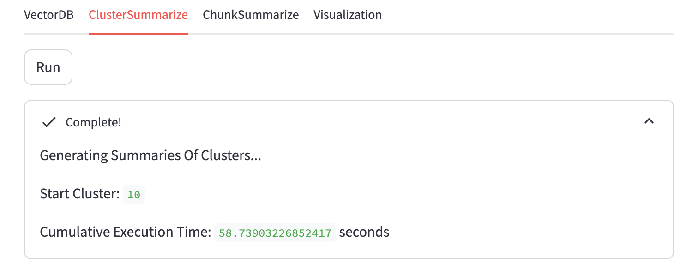

## Build summary of chunk by Azure OpenAI service.
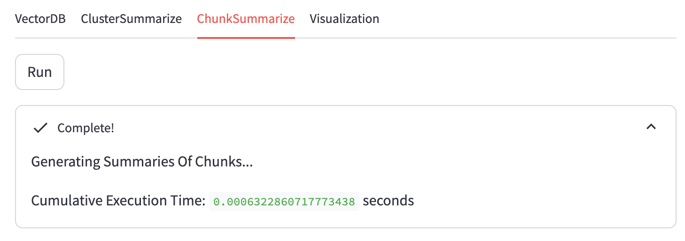

## Select how many clusters of chunk.
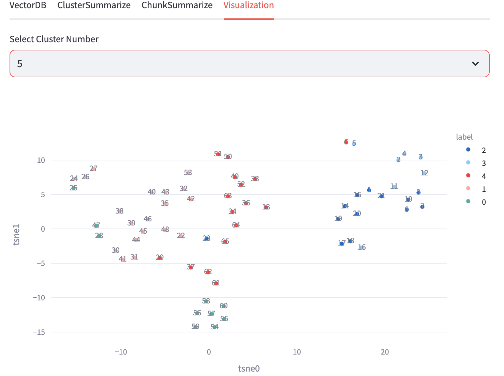

## View the summaries of cluster and chunk.
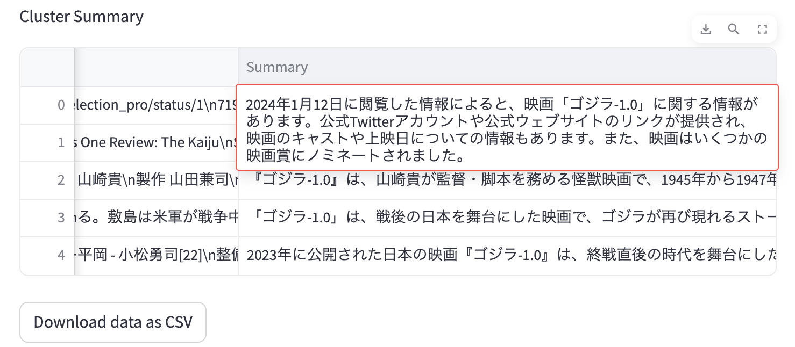

