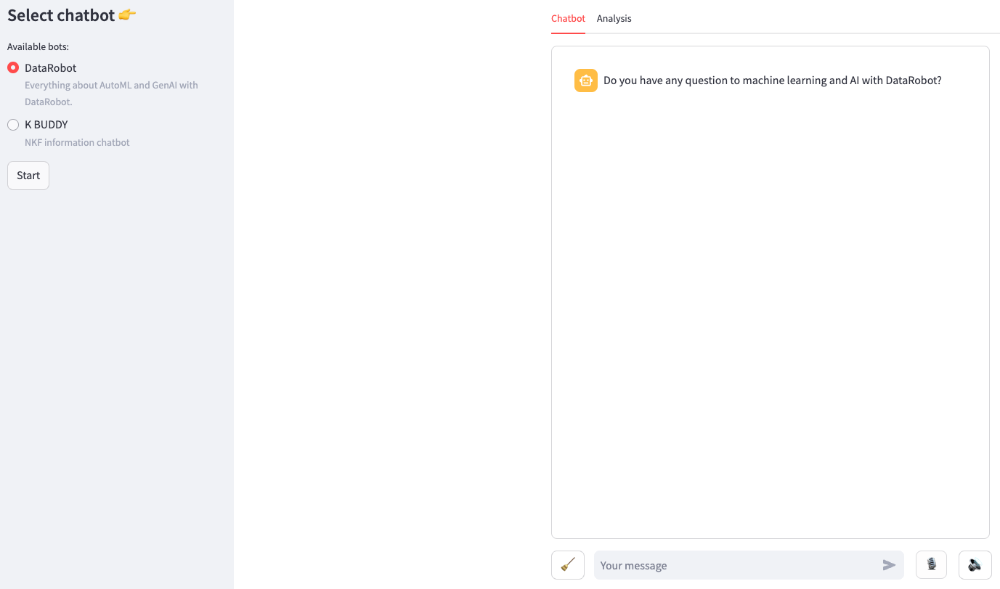
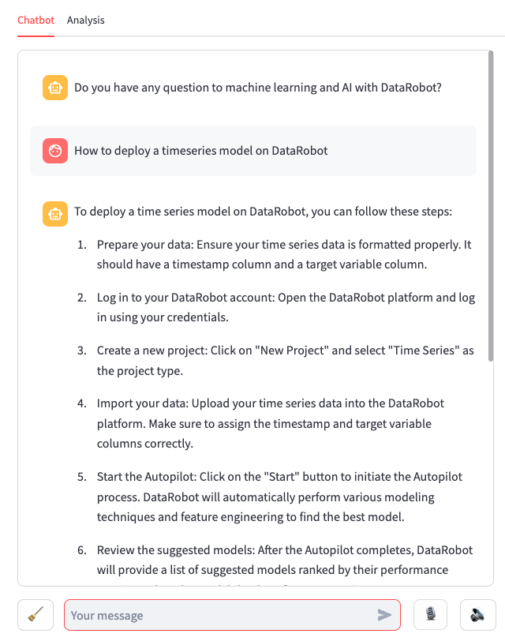
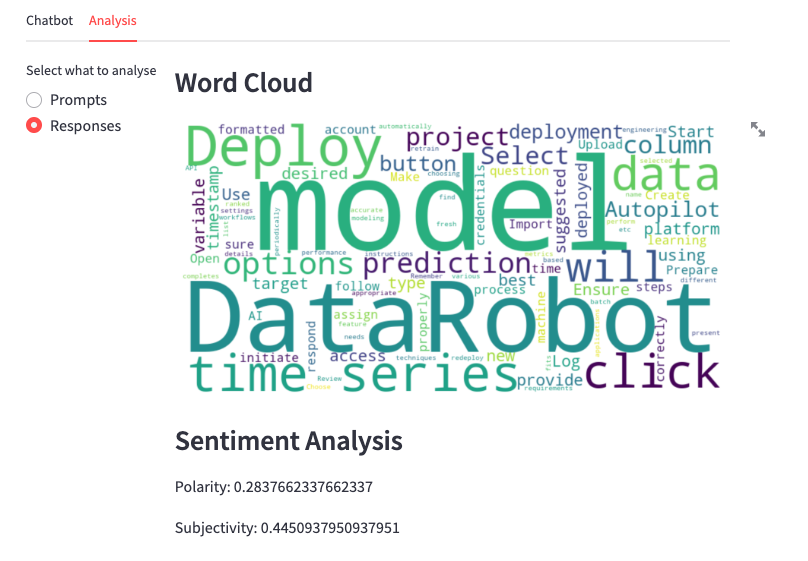

# Voice chatbot app with DataRobot

**Author:** Dean Wang

**Date:** Aug 30th, 2024

## Problem framing

DataRobot supports various interfaces for the LLM application deployed on DataRobot, leveraging the [Prediction API](https://docs.datarobot.com/en/docs/api/reference/predapi/dr-predapi.html). 

This AI Accelerator demonstrates how to implement a Streamlit application to interact with a GenAI deployment on DataRobot, and enable the voice input and output. It can support multiple chatbots with the same interface. The user of this AI Accelerator is expected to be familiar with the deployment of LLM's in DataRobot. 

## Accelerator overview

This accelerator requires a genAI project [built and deployed](https://docs.datarobot.com/en/docs/gen-ai/deploy-llm.html) on DataRobot.

The following steps outline the accelerator workflow.

<b>Step 1</b> From playground, [register and deploy](https://docs.datarobot.com/en/docs/gen-ai/deploy-llm.html) a genAI model.

<b>Step 2 (optional)</b> Deploy multiple models if needed. Update the deployment ID's in the code.

<b>Step 3</b> Run the code as a [streamlit app](https://docs.streamlit.io/develop/concepts/architecture/run-your-app). 

## Select a chatbot and click start:

## Chat through the text or voice input via the microphone button:

## Playback the response by clicking the speaker button:

## View analysis and word cloud in the analysis tab:

