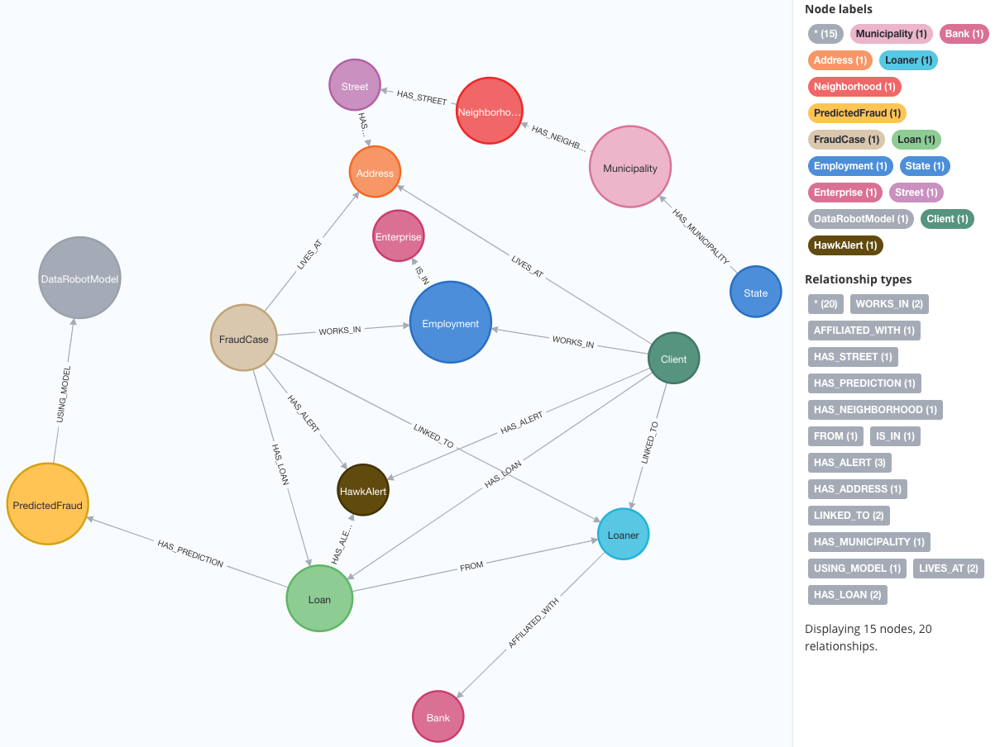

# Fraud Detection with Neo4j & DataRobot



This repository demonstrates how to build a **fraud detection pipeline** using:
- **Neo4j** for storing and querying a knowledge graph of clients, loans, addresses, etc.
- **DataRobot** for building a predictive model using graph-based features.

## Folder Structure
	. 
	├── 01_create_neo4j_db.ipynb 
	├── FraudGraphFeatureExtractor.py 
	├── 02_fraud_detection_dr_project_and_update_neo4j.ipynb 
	├── requirements.txt 
	└── Selected Features.csv

### 1. `01_create_neo4j_db.ipynb`
  **Jupyter notebook** illustrating how to:
- **Install** or **start** a local **Neo4j 4.4.11** instance,
- Load a Neo4j database from a `.dump` file (if desired),
- Provide best practices for uploading the `.dump` either with the CLI (`neo4j-admin load`) or via **Neo4j Desktop** “Create from dump.”

### 2. `FraudGraphFeatureExtractor.py`
  **Python module** containing:
- **`ClientLoanFeatureExtractor`** class:  
  - Extracts (Client–Loan) rows from a Neo4j graph, generating features such as:
    - Client properties (`Fraud=1` if `:FraudCase`),
    - Loan details (status, balance, type),
    - Loaner-based features (loaner’s total rejected loans),
    - Node-level features: `degree`, `fraud_neighbor_count`, `fraud_loaner_count`, `rejected_loan_count`.
  - Produces a **single** DataFrame row per (Client–Loan) pair.
- **(Optional) Additional utility** for updating predictions back into Neo4j (e.g., `update_neo4j_predictions`).

### 3. `02_fraud_detection_dr_project_and_update_neo4j.ipynb`
  **Jupyter notebook** that illustrates:
1. **Extracting** graph data via `ClientLoanFeatureExtractor` into train/holdout CSV files.
2. **Uploading** the training set to **DataRobot** to build a classification model (target = `Fraud`).
3. **Selecting** the best model from the DataRobot Leaderboard, retrieving **model details** (e.g., blueprint, metrics).
4. **Scoring** the holdout (pending loans) in DataRobot to generate predictions and top feature explanations.
5. **Updating** Neo4j with the new predictions, labeling or linking suspicious loans with `PredictedFraud` nodes.

### 4. `requirements.txt`
Lists the main **Python dependencies** for this project:
- **pandas**: DataFrame operations,
- **neo4j**: Official Neo4j driver,
- **datarobot**: DataRobot Python SDK for creating projects, scoring, etc.,
- other utilities like **python-dateutil** if needed.

Install them using:
```bash
pip install -r requirements.txt
