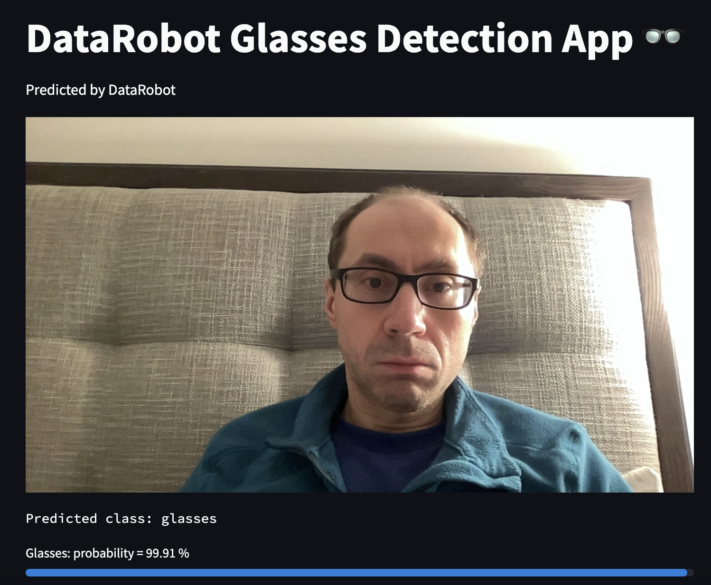
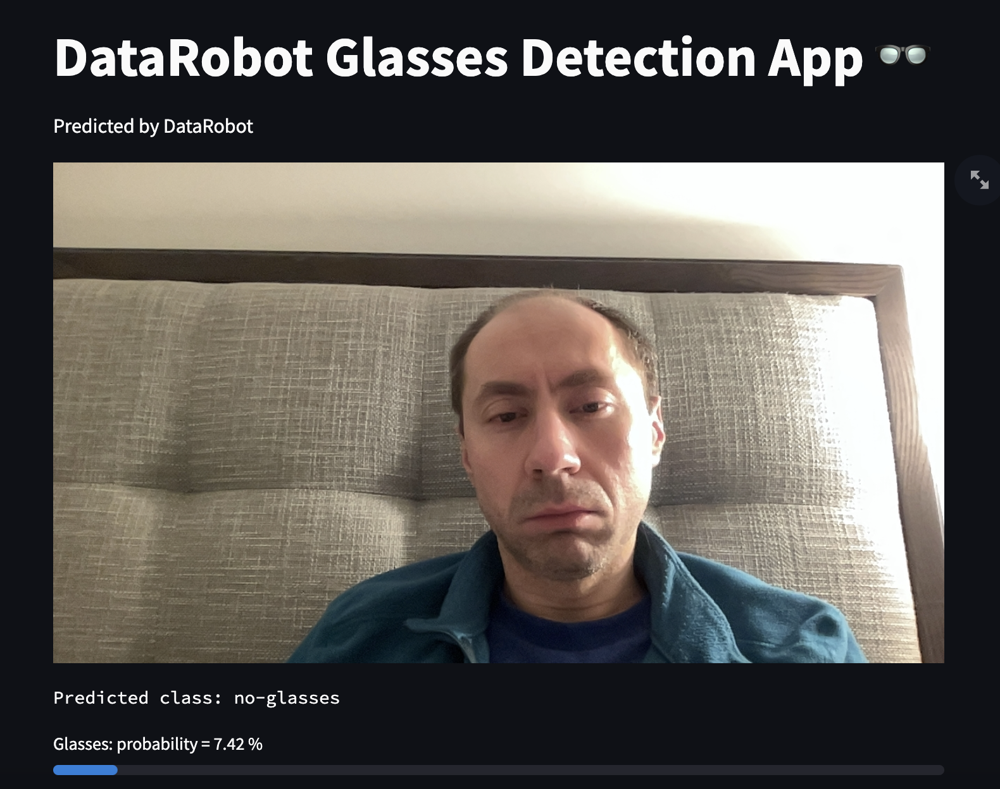

# Object Classification on Video with DataRobot Visual AI

**Author:** Pavel Ustinov

**Date:** January 18th, 2024

## Problem framing

[DataRobot Visual AI](https://docs.datarobot.com/en/docs/modeling/special-workflows/visual-ai/index.html#visual-ai) allows you to train deep learning models intended for the Computer Vision projects that are demanded by the different industries. The object detection (binary and multiclass classification) applied to image and video processing is one of the tasks that can be easily and efficiently implemented with the DataRobot Visual AI. You can also bring your own Computer Vision model and deploy it in DataRobot via [Custom Model Workshop](https://docs.datarobot.com/en/docs/mlops/deployment/custom-models/custom-model-workshop/index.html#custom-model-workshop).

This AI Accelerator demonstrates how deep learning model trained and deployed with DataRobot platform can be used for object detection on the video stream (detection if person in front of camera wears glasses). The Elastic-Net Classifier (L2 / Binomial Deviance) along with Pretrained MobileNetV3-Small-Pruned Multi-Level Global Average Pooling Image Featurizer with no image augmentation have been used for this Accelerator. The dataset used for the training can be found [here](https://github.com/cleardusk/MeGlass), it contains images for 2 classes: persons with glasses and persons without glasses. The full size of the original dataset is 13.3 GB, of the cropped dataset is 335.8 MB. The small sample of the cropped dataset (100 images for each class) has been used for this AI Accelerator. The video stream is captured with OpenCV Computer Vision library. The frontend part has been implemented as a Streamlit application. The user of this AI Accelerator is expected to be familiar with the training and deployment process with DataRobot. 

## Accelerator overview

This accelerator requires:

- DataRobot deployment ID of the deep learning model.
- Installed [OpenCV Computer Vision library](https://opencv.org/).
- Installed [Streamlit framework](https://streamlit.io/).

The following steps outline the accelerator workflow.

1. Install OpenCV (<code>pip install opencv-python</code>)

2. Install Streamlit (<code>pip install streamlit</code>)

3. Train and deploy a deep learning model with DataRobot

4. Implement Streamlit app (the code source can be found in this repository)

5. Run application <code>streamlit run app.py -- --deployment_id DEPLOYMENT_ID</code>

