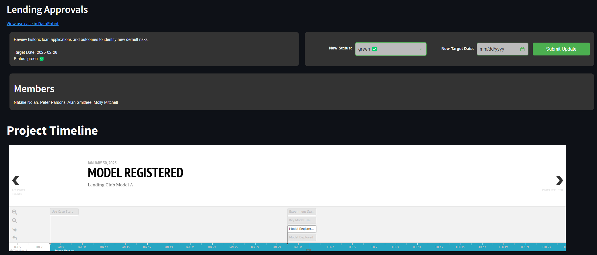

# Use Case explorer

DataRobot provides management capabilities for a variety of personas. Using data across Use Cases, experiments, the Model Registry, and deployments you can report on the full lifecycle of an AI project. The goal of this accelerator is to provide a template for a project management dashboard that collects all the key artifacts in a Use Case and displays them on a timeline. It also allows project managers to define a target date and overall status for each Use Case.

## Usage

The left-hand navigation menu will list all of your current Use Cases along with their defined status. If this is the first time you're using the app, it is likely that the status will be undefined for your Use Cases. Clicking on a menu item will take you into a detailed view of the use case and the associated assets. It also presents a scrollable timeline that illustrates project progress.

From this page you can also define or update the project status and target date. These values are fed into the description field of the use case object, so they will also be visible inside the DataRobot platform.
