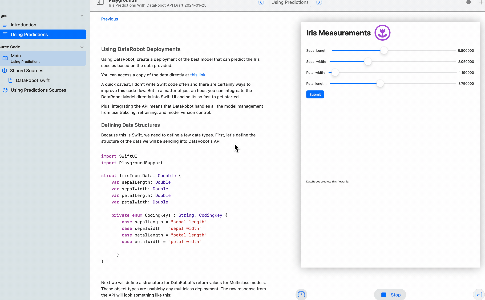

# Using  DataRobot Predictions in Mobile Apps

An AI model can't just be an experiment. AI Predictions need to be in the hands of real users interactive with customers, products, or users. This accelerator demonstrates how to incorporate DataRobot predictions into a mobile app. 

Included in this repository is a Swift Playground App Prototype. The playground is generates an App that uses the Iris dataset and calls a DataRobot model to predict the likely sub-species of Iris plant. 

## Running the Playground

Simply "import" the playground into the Swift Playgrounds app on your Mac or iPad. There are two "pages" within the playground: 

1. **Introduction**: Loads the dataset and presents the problem. 
2. **Calling the Predictions**: Shows a `DRPredictor` class that can call the DataRobot API and integrate the response in SwiftUI. 

